The contents of this repo are not finished, and subject to change at any minute. I would not use this code at all as it currently stands. 

# PySplit v0.0

PySplit is a speedrun timer built on Python and PyQt6 with the aim of being a fully cross-platform speedrun timing solution.

## Description

## Getting Started

### Dependencies

* [PySide6 6.8.2.1](https://pypi.org/project/PySide6/6.8.2.1/)
* [pynput 1.7.7](https://pypi.org/project/pynput/1.7.7/)

### Installing

* how to install this thing when it gets done

### Configuration

* how to style the timer
* how to configure the other settings

## Authors

Contributors info
- [hunterhusker](https://github.com/Hunterhusker)

## License

This project is licensed under the "LGPL-2.1" License - see the LICENSE.md file for details

## Acknowledgements

Inspiration, code snippets, and other things I would like to thank
* [README-Template](https://gist.github.com/DomPizzie/7a5ff55ffa9081f2de27c315f5018afc)
* [QT For Python Docs](https://doc.qt.io/qtforpython-6.6/index.html)
* [ChatGPT a.k.a. Rubber Ducky with ideas](https://chat.openai.com/)
* [inputs docs](https://inputs.readthedocs.io/en/latest/)
* [pynput docs](https://pynput.readthedocs.io/en/latest/)

```mermaid
classDiagram
    class main {
        layout: QVBoxLayout
        Title: TitleWidget
        context_menu: QMenu
        configurator: Configurator
        splits: SplitsWidget
        game_timer: Timer
        timer_controller: TimerController
        open_settings_popup()
        lock_action(checked: bool)
        set_style(stylesheet: str)
        get_style()
        closeEvent(event)
        mousePressEvent(event)
        mouseMoveEvent(event)
        mouseReleaseEvent(event)
    }
    main "1" --* "1" TitleWidget
    main "1" --* "1" Configurator
    main "1" --* "1" TimerWidget
    main "1" --* "0..1" SplitsWidget
    main "1" --*"0..1" TimeStatsWidget
    main "1" --*"0..1" SplitGraphWidget
    main "1" --o "1" Timer
    main "1" --o "1" TimerController
    main "1" --o "1" Game

    class Game {
        from_json(json_dict: dict)
        from_json_file(file_path: str)
        to_dict(): dict
        to_json(): str
        \_\_str\_\_(): str
        title: str
        sub_title: str
        splits: list[Split]
        lifetime_attempts: int
        session_attempts: int
    }

    class Split {
        from_json(json_dict: dict, prev_pb_segment_total_ms: int, prev_gold_segment_total_ms: int)
        from_json_str(json_str: str, prev_pb_segment_total_ms, prev_gold_segment_total_ms: int)
        \_\_str\_\_(): str
        to_dict(): dict
        to_json(): str
        split_name: str
        pb_time_ms: int
        pb_segment_ms: int
        gold_segment_ms: int
        pb_segment_total_ms: int
        gold_segment_total_ms: int
    }
    Game "1" --o  "1.." Split

    class TitleWidget {
        layout: QVBoxLayout
        title_label: QLabel
        subtitle_label: QLabel
        attempt_counter_hbox: QHBoxLayout
        tries_today_label: QLabel
        update_time(time: int)
    }

    class Configurator {
        Configure: Signal[dict]
        ConfigureGame: Signal[dict]
        settings_file_path: str
        game_settings_file_path: str
        settings: dict[str, any]
        game_settings: dict[str, any]
        style: StyleBuilder
    }
    Configurator --o StyleBuilder

    class StyleBuilder {
        UpdateStyle: Signal
        style_path: str
        vars_path: str
        variable_map: dict[str, str]
        raw_style_sheet: str
        load_vars()
        set_vars(variable_map: dict[str, str])
        export_vars()
        load_style()
        set_style(styleSheet: str)
        format_style()
        export_style()
        update_style(style_sheet: str, var_map: dict[str, str])
        update_style_from_paths(style_path: str, vars_paths: str)
    }

    class TimerWidget {
        layout: QVBoxLayout
        main_timer_label: QLabel
    }

    class SplitsWidget {
        visible_splits: int
        layout: QVBoxLayout
        scroll_widget: QWidget
        scroll_widget_layout: QVBoxLayout
        scroll_area: QScrollArea
        splits: list
        index: int
        curr_time: float
        started: bool
        done: bool
        get_current_split()
        increment_split(inc: int)
        decrement_split(inc: int)
        update_split(curr_time: int)
        handle_control(event: str)
        export_splits(indent: str, depth: int) -> str
        load_splits(splits: list[dict[str: any]])
        reset_splits()
        update_splits()
    }
    SplitsWidget "1" --* "0..n" SingleSplitWidget

    class SingleSplitWidget {
        split_name: str
        pb_time_ms: int
        gold_segment_ms: int
        pb_segment_ms: int
        current_time_ms: int
        current_segement_ms: int
        current_start_time: int
        display_time_ms: int
        layout: QHBoxLayout
        split_name_label: QLabel
        time_label: QLabel
        delta_label: QLabel
        update_split(curr_time_ms: int)
        get_comparison_time() -> int
        reset_split()
        finalize_split()
        export_data(indent: str, depth: int) -> str
        handle_control(event: str)
    }

    class TimeStatsWidget {
        TODO
    }

    class SplitGraphWidget {
        TODO
    }

    class ABCListener {
        <<abstract>>
        run()
        listen()
        on_input_event()
        pause_listening()
        resume_listening()
        quit()
        on_press()
        obj_to_str()
        str_to_obj()
    }

    class ABCListenedObject {
        <<abstract>>
        \_\_init\_\_(obj)
        \_\_eq\_\_(other)
        \_\_str\_\_()
        \_\_repr\_\_()
        \_\_hash\_\_()
        serialize()
        deserialize()
    }

    class KeyboardListener {
        on_press: Signal[pynput.Keyboard.Key]
        listener: pynput.Keyboard.listener
        listening: bool
        run()
        listen()
        on_input_event(key)
        pause_listening()
        resume_listening()
        quit()
    }

    class KeyPressObject {
        source: str
        value: str
        obj: pynput.Keyboard.Key
        \_\_init\_\_(obj: pynput.Keyboard.Key)
        \_\_eq\_\_(other)
        \_\_hash\_\_()
        \_\_str\_\_()
        \_\_repr\_\_()
        serialize() -> dict[str, str]
        deserialize(obj: dict[str, str])
        key_to_str(key: pynput.Keyboard.Key)
        str_to_key(key_str: str)
    }
    ABCListenedObject <|-- KeyPressObject 
    ABCListener <|-- KeyboardListener
    KeyboardListener ..|> KeyPressObject

    class Timer {
        update: Signal
        paused: bool
        running: bool
        prevTime: int
        timer: QElapsedTimer
        update_timer: QTimer
        event_map: dict[str, func]
        \_\_init\_\_()
        run()
        handle_control()
        doNothing()
        startsplit_timer()
        reset_timer()
        stop_timer()
        pause_timer()
        resume_timer()
        read_str()
        read()
        quit()
    }

    class TimerController {
        ControlEvent: Signal[str]
        \_\_init\_\_(Listeners: list[ABCListener], event_map: dict[str, any])
        input_event(event_obj)
        update_mapping(event_map: dict[KeyPressObject, str])
        get_mapping()
        add_mapping(key: ABCListener, value: str)
        remove_mapping(key: ABCListener)
        export_mapping() -> str
        import_mapping(serialized_event_map)
        add_listener(listener: ABCListener)
        add_listeners(listeners: list[ABCListener])
        remove_listener(listener: ABCListener)
        pause_listeners()
        resume_listeners()
        toggle_listening()
    }
    TimerController --> ABCListener

    class SettingsWindow {
        layout: QVBoxLayout
        keyWidget: AssignButtonsTab
    }
    SettingsWindow --* ABCSettingsTab

    class ABCSettingsTab {
        <<abstract>>
        apply()
    }

    class AssignButtonsTab {
        layout: QVBoxLayout
        main: main
        scroll_widget: QWidget
        scroll_widget_layout: QVBoxLayout
        scroll_area: QScrollArea
        event_map: dict[str, str]
        listener: KeyboardListener
        keys: list[str]
        values: list[str]
        assignStartSplit: KeyReassignmentLine
        assignUnsplit: KeyReassignmentLine
        assignPause: KeyReassignmentLine
        assignResume: : KeyReassignmentLine
        assignReset: KeyReassignmentLine
        assignStop : KeyReassignmentLine
        assignSkipSplit: : KeyReassignmentLine
        assignLock: KeyReassignmentLine
        widgets: dict[str, KeyReassignmentLine]
        \_\_init\_\_()
        apply()
        assign_mapping(key: str, timer_event: str)
    }

    class KeyReassignmentLine {
        listening: bool
        event_object: str
        timer_event: str
        key_str: str
        line_layout: QHBoxLayout
        event_label: QLabel
        trigger_button: QPushButton
        \_\_init\_\_(listener, event_object, timer_event: str, label: str)
        assign_key(obj)
        toggle_listening()
        listen_for_key(event_object)
    }
    AssignButtonsTab --* KeyReassignmentLine

    class LayoutTab {
        TODO
    }

    class SplitsTab {
        layout: QVBoxLayout
        main: main 
        game_settings: dict[str, str]
        add_button: QPushButton
        \_\_init\_\_(mainWindow: main)
        import_splits(game_settings: dict[str, str])
        exportSplits()
        addEmptySplit()
        remove_split(split: SplitLine)
        apply()
    }
    SplitsTab ..> Game

    class SplitLine {
        layout: QHBoxLayout
        bestTimeMS: int 
        goldTimeSegementMs: int 
        splitNameInput: QLineEdit 
        bestTimeInput: QTimeEdit 
        bestSegmentInput: QTimeEdit
        goldSegmentInput: QTimeEdit 
        removeButton: QPushButton 
        export()
    }

    class StyleTab {
        main: main 
        update_key(key: str, value: str)
        \_\_init\_\_(mainWindow: main)
        apply()
    }

    class StyleSettingLine {
        UpdateKey: Signal[str, str]
        layout: QHBoxLayout
        parent: StyleTab
        key: str
        label: QLabel
        textInput: QLineEdit
        \_\_init\_\_(key: str, value: str, parent: StyleTab)
        textChanged()
    }
    main --> SettingsWindow
    ABCSettingsTab <|-- AssignButtonsTab
    ABCSettingsTab <|-- LayoutTab
    ABCSettingsTab <|-- SplitsTab
    ABCSettingsTab <|-- StyleTab
    StyleTab --* StyleSettingLine
    SplitsTab --* SplitLine

```

